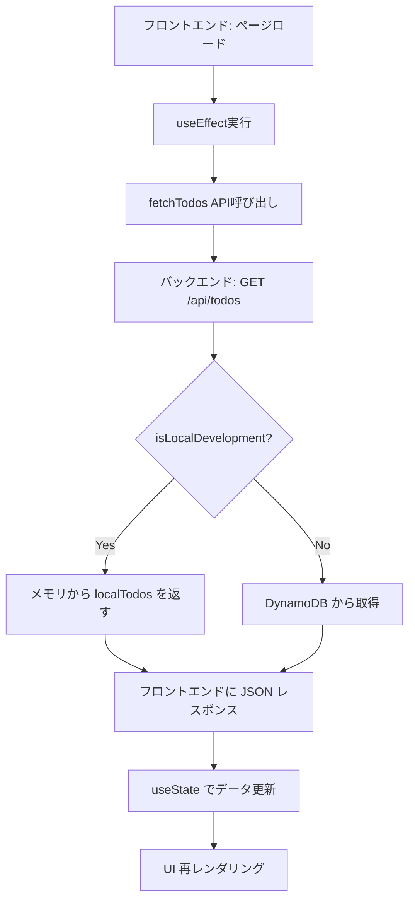
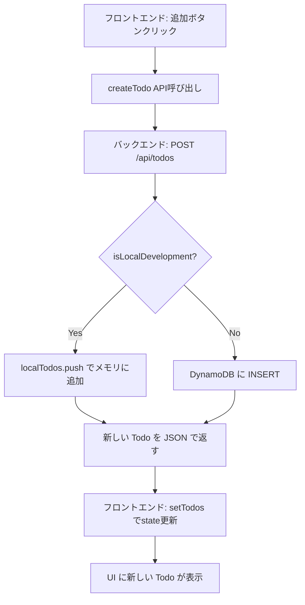

# ローカル開発環境でのデータ永続化の仕組み

## 概要

このプロジェクトでは、開発環境と本番環境で異なるデータ保存方式を採用しています。
開発環境では **Node.js のメモリストレージ** を使用し、本番環境では **DynamoDB** を使用します。

## データ永続化の仕組み

### 1. 環境自動判定

```typescript
// backend/src/worker.ts
const isLocalDevelopment = () => {
  return !process.env.AWS_REGION && !process.env.TABLE_NAME;
};
```

この関数により、環境変数の有無で自動的に開発環境か本番環境かを判定します。

### 2. 開発環境：メモリストレージ

```typescript
// ローカル開発用のメモリストレージ
let localTodos: Todo[] = [
  {
    id: '1',
    title: 'CI/CDパイプラインを学ぶ',
    completed: true,
    createdAt: new Date().toISOString(),
    updatedAt: new Date().toISOString(),
  },
  {
    id: '2',
    title: 'Honoでバックエンドを作る',
    completed: false,
    createdAt: new Date().toISOString(),
    updatedAt: new Date().toISOString(),
  },
];
```

#### メモリストレージの特徴

| 特徴             | 説明                                     |
| ---------------- | ---------------------------------------- |
| **保存場所**     | Node.js プロセスの RAM（メモリ）         |
| **データ寿命**   | バックエンドプロセスが動作している間のみ |
| **アクセス速度** | ⚡ 超高速（メモリ直接アクセス）          |
| **設定の複雑さ** | 🟢 設定不要                              |
| **永続性**       | ❌ プロセス終了で消失                    |

### 3. 本番環境：DynamoDB

```typescript
// DynamoDB設定（本番環境用）
const client = new DynamoDBClient({});
const docClient = DynamoDBDocumentClient.from(client);
const tableName = process.env.TABLE_NAME || 'TodoApp';
```

#### DynamoDB の特徴

| 特徴             | 説明                                           |
| ---------------- | ---------------------------------------------- |
| **保存場所**     | AWS DynamoDB（クラウドデータベース）           |
| **データ寿命**   | 明示的に削除するまで永続保存                   |
| **アクセス速度** | 🟡 ネットワーク経由（高速だが メモリより遅い） |
| **設定の複雑さ** | 🔴 AWS 設定・認証が必要                        |
| **永続性**       | ✅ 完全永続化・冗長性あり                      |

## データ操作の流れ

### データ取得の流れ



### データ追加の流れ



## 実際の動作例

### 1. バックエンド起動時

```bash
$ cd backend && npm run dev
🔥 Hono server starting on port 3001
```

この時点で、メモリに初期データが設定されます：

```javascript
localTodos = [
  { id: '1', title: 'CI/CDパイプラインを学ぶ', completed: true },
  { id: '2', title: 'Honoでバックエンドを作る', completed: false },
];
```

### 2. フロントエンドからのデータ取得

```bash
# リクエスト
GET http://localhost:5173/api/todos

# Vite プロキシ経由で転送
GET http://localhost:3001/api/todos

# レスポンス（メモリから）
{
  "todos": [
    { "id": "1", "title": "CI/CDパイプラインを学ぶ", "completed": true },
    { "id": "2", "title": "Honoでバックエンドを作る", "completed": false }
  ]
}
```

### 3. 新しい Todo 追加

```bash
# フロントエンドからのリクエスト
POST http://localhost:5173/api/todos
{ "title": "新しいタスク" }

# バックエンドでの処理
localTodos.push({
  id: "uuid-generated",
  title: "新しいタスク",
  completed: false,
  createdAt: "2025-08-26T04:09:12.138Z",
  updatedAt: "2025-08-26T04:09:12.138Z"
});
```

### 4. ブラウザリロード時

```bash
# ブラウザリロード → フロントエンドの state リセット
# useEffect 実行 → API から再取得
GET /api/todos → メモリから全データ取得 → 画面に表示
```

### 5. バックエンド再起動時

```bash
# バックエンドプロセス停止
$ pkill -f "tsx watch src/worker.ts"

# データ状態: localTodos は消失（メモリクリア）

# バックエンド再起動
$ npm run dev
🔥 Hono server starting on port 3001

# データ状態: 初期データのみに戻る
localTodos = [初期の2件のみ];
```

## データが保持される/失われる条件

### ✅ データが保持される条件

1. **ブラウザのページリロード**

   - フロントエンドの状態はリセットされるが、バックエンドのメモリは保持
   - `useEffect` で再取得されるため、追加したデータも表示される

2. **フロントエンドの再起動**

   - バックエンドプロセスが継続していれば、メモリデータは保持

3. **ブラウザの開き直し**
   - 新しいタブで開いても、バックエンドから最新データを取得

### ❌ データが失われる条件

1. **バックエンドプロセスの停止・再起動**

   ```bash
   pkill -f "tsx watch src/worker.ts"  # プロセス終了 → メモリクリア
   npm run dev                         # 再起動 → 初期データのみ
   ```

2. **PC の再起動・スリープからの復帰**

   - Node.js プロセスが終了するため、メモリデータは消失

3. **ターミナルウィンドウを閉じる**

   - バックエンドプロセスが終了するため

4. **コードの変更（tsx watch による自動再起動）**
   ```bash
   # worker.ts を編集・保存
   [tsx] change detected, restarting...  # 自動再起動 → メモリリセット
   ```

## 開発時のデータ永続化テクニック

### 1. データをリセットしたい場合

```bash
# バックエンドを再起動して初期状態に戻す
$ pkill -f "tsx watch src/worker.ts"
$ cd backend && npm run dev
```

### 2. データを保持したまま開発したい場合

```bash
# worker.ts 以外のファイル（フロントエンド等）を編集
# → バックエンドプロセスは継続するため、メモリデータ保持
```

### 3. 開発用の初期データを増やしたい場合

```typescript
// backend/src/worker.ts
let localTodos: Todo[] = [
  // 既存データ...
  {
    id: '3',
    title: '開発用のサンプルタスク',
    completed: false,
    createdAt: new Date().toISOString(),
    updatedAt: new Date().toISOString(),
  },
];
```

## 設計の利点

### 1. **開発効率の向上**

- データベース設定不要でアプリ開発開始可能
- 高速なデータアクセスでスムーズな開発体験

### 2. **本番環境との差異最小化**

- API インターフェースは同一
- 環境変数で自動切り替えのため、デプロイ時の変更不要

### 3. **テストデータ管理の簡素化**

- 間違ったデータは再起動でリセット
- 初期データは常に一定で、テストの再現性確保

## 注意点とベストプラクティス

### ⚠️ 注意点

1. **長時間の開発セッション**

   - 重要なテストデータは別途記録しておく
   - バックエンドの意図しない再起動に注意

2. **チーム開発**
   - メモリデータは各開発者のローカル環境固有
   - データ共有が必要な場合は別途対策が必要

### 💡 ベストプラクティス

1. **定期的なコミット**

   ```bash
   # テストデータが充実してきたら、初期データに反映
   git add . && git commit -m "開発用初期データを更新"
   ```

2. **環境の明確な分離**

   ```bash
   # 開発環境であることを明示
   echo "DEVELOPMENT MODE - Data in memory only"
   ```

3. **ログ出力でデータ状態を把握**
   ```typescript
   if (isLocalDevelopment()) {
     console.log(`📊 Current todos count: ${localTodos.length}`);
   }
   ```

---

**作成日**: 2025-08-26  
**対象環境**: ローカル開発環境  
**関連技術**: Node.js, Hono, React, TypeScript  
**データ形式**: JSON (Todo オブジェクト)
